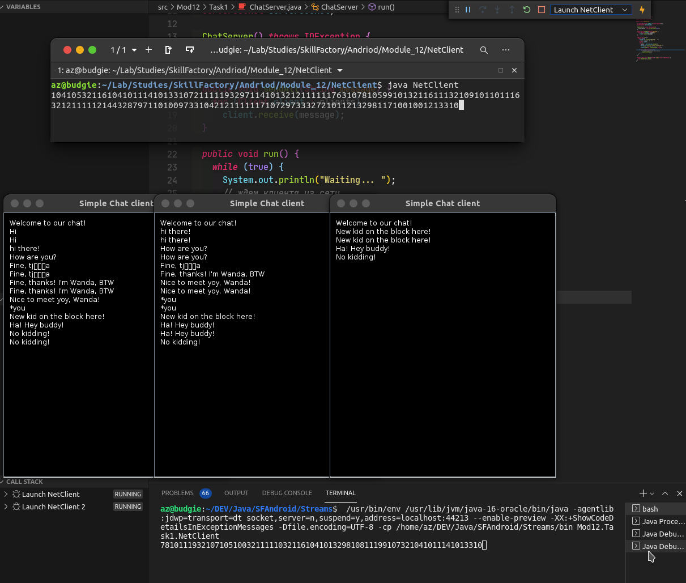

## Задание 12.3.3

Этой программе очень недалеко до сетевого чата. Сделайте самый простой чат-сервер на базе этой программы и отправьте на проверку ментору.

**Минимальная функциональность успешно выполненного задания:** к серверу может присоединиться несколько клиентов одновременно. Всё, что пишется на любом из клиентов, передается в окна других клиентов после нажатия на Enter. При отсоединении любого клиента программа должна продолжать работать корректно. Уже присоединенные клиенты продолжают общаться между собой, и к ним могут присоединиться новые.

## Скриншот:

