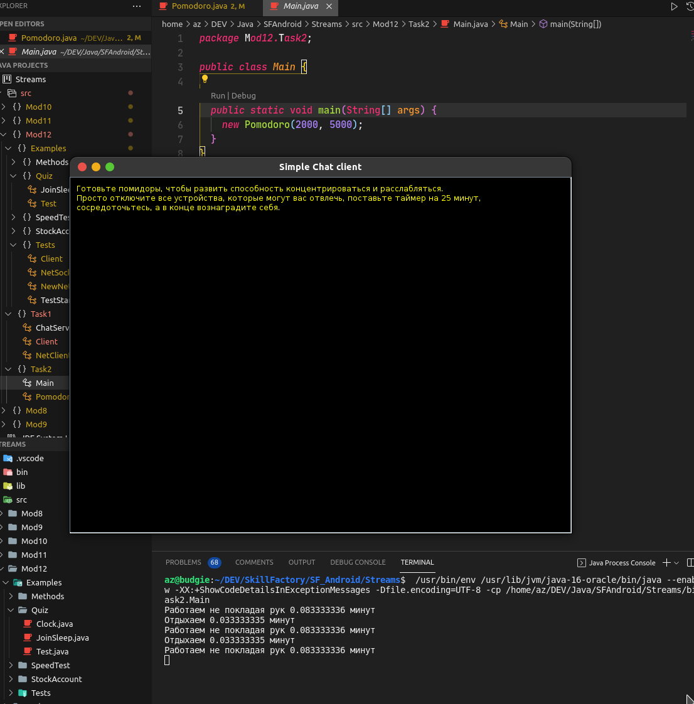

## Задание 2

На основе NetClient из задания 12.3.3 написать программу типа “Помодоро”, которая открывает и закрывает окно через заданные интервалы. Необязательно 25 минут.)
Размеры окна и оформление сообщения - на свой вкус.

## Скриншот:

